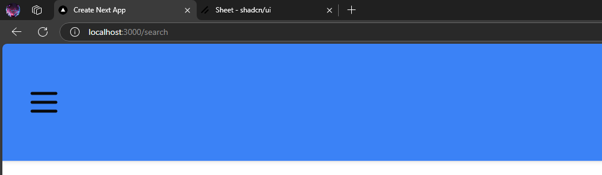

# Learning management system

## Basic Folder Setup

Any folder that has `page.tsx` is considered to be a route.
What if we want a folder to be used as <i>structuring our code </i>? -> use route groups as (routeGroupName) ie. using parenthesis and giving a name which will not be translated as route
eg:`(testRouteGroup)`

## Authentication using <b>Clerk</b>

[Clerk Website documentation](https://clerk.com/docs)

I used clerk becuase it gives latest security features. We can set some public pages to be accessed without logging in app.

---

### Navbar

#### For a Mobile Device we need a menu type icon to know we can access our navbar items.

We can use lucid-react's Menu icon as:

```jsx
// Importing Menu from lucid-react for icon purpose
import { Menu } from "lucide-react";

export const MobileSidebar = () => {
  return <Menu />;
};
```

- This `MobileSidebar` component is used inside `Navbar` component.

```jsx
<div className="p-4 border-b h-full flex items-center bg-blue-500 shadow-sm ">
  {/* Menu Bar for small devices */}
  <MobileSidebar />
</div>
```

This Menu icon is not clickable.


### How to make this Menu icon interactive??

<b>Using Shadcn's `sheet`.
Sheet :
Extends the Dialog component to display content that complements the main content of the screen</b>

    npx shadcn@latest add sheet

Sheet are used in those components that are needed to be made interactive. For exampe: in `MoblieSidebar` component. As we need to make that Menu icon interactive in the small devices and to display the `SideBar` component.

// Using shadcn's sheet in the file where we need to extend the dialog comonent. For this case our `Sidebar` component.

```jsx
import { Sheet, SheetContent, SheetTrigger } from "@/components/ui/sheet";
```

#### Now, we Wrap the Component that we need to make interactive.

In our project, we need to make our `Menu` icon interactive.

- `<Sheet> </Sheet>` => We should wrap our component that we need to make it interactive and extend
- `<SheetTrigger> </SheetTrigger>` => Inside this component, we put that compnent which should trigger the action to extend something.
- `<SheetContent> </SheetContent>` => We put the content that needs to be shown as soon as the component or icon is cliked(ie triggered)

Sample Code:

```tsx
// Importin Menu from lucid-react for icon purpose
import { Menu } from "lucide-react";
import { Sidebar } from "./sidebar";

// Using shadcn's sheet
import { Sheet, SheetContent, SheetTrigger } from "@/components/ui/sheet";

export const MobileSidebar = () => {
  return (
    <Sheet>
      <SheetTrigger className="md:hidden pr-4 hover:opacity-75 transition">
        <Menu />
      </SheetTrigger>

      <SheetContent side={"left"} className="p-0 bg-white">
        <Sidebar />
      </SheetContent>
    </Sheet>
  );
};
```
